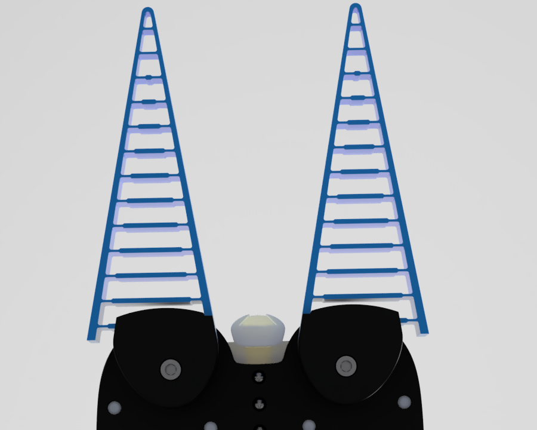

>[>> Fusion 360 - WebViewer](https://a360.co/2W6mHcp)

## About the Rae Project
Rae stays for *Robot-autonomy-
effector* and is an __OpenSource__ based modular end-of-arm tool with integrated __eye-in-hand__ depth camera which enables researchers, AI-enthusiasts and engineers to develop and deploy autonomous applications for robot manipulators. The 6 different module-types helps to solve various modern challenges in Robotics as for example bin-picking, packaging or tool-based automation. The design originates from the Bachelor-thesis created by Roman Baur and was further developed at the university of applied science in Esslingen.

## [Table of content](#table-of-content)

- [Getting Started](#getting-started)
- [Base-System](#base-system)
- [Realsense System](#realsense-system)
- [Kinect System](#kinect-system)
- [Gripper Fingers](#gripper-fingers)
  - [Festo DAHS-80 Radialgripper](#festo-dahs-80-radialgripper)
  - [Festo DAHS-120 Radialgripper](#festo-dahs-120-radialgripper)
- [Flanges](#flanges)
- [Tools](#tools)
- [Credits](#credits)

# Getting Started

How I get an working rae:

1. Download the .stl files from the [base-system](base-system) including drive and guide parts
2. Choose whether you want a [realsense](perception-modules/realsense) or a [kinect](perception-modules/kinect) perception system and download the according .stl files.
3. Print it with a high-quality SLS-Printer.
4. Assemble the the printed parts and the electric components with the appropriate screws.
5. Download the Image for the embedded linux called raeos and flash it on an SD-Card. Then boot the system.

> If you want to have an assembled and preinstalled rae, please contact [themakeservice](#)

How to set up my rae:
1. Install the raeros-client on your host system and setup an ethernet or wireless based connection to the rae-system.

# Base-System

> [>> base-system](base-system)

# Realsense System

> [>> realsense-system](perception-modules/realsense)

# Kinect System

> [>> kinect-system](perception-modules/kinect)

# Gripper Fingers
## Festo DAHS-80 Radialgripper

## Festo DAHS-120 Radialgripper

# Flanges
[Flange for Franka Panda, mounted]

# Tools

# Credits
Mady by Roman Baur:
* Modular Concept
* Mechanical-, Electrical- and Software-Design
* 
