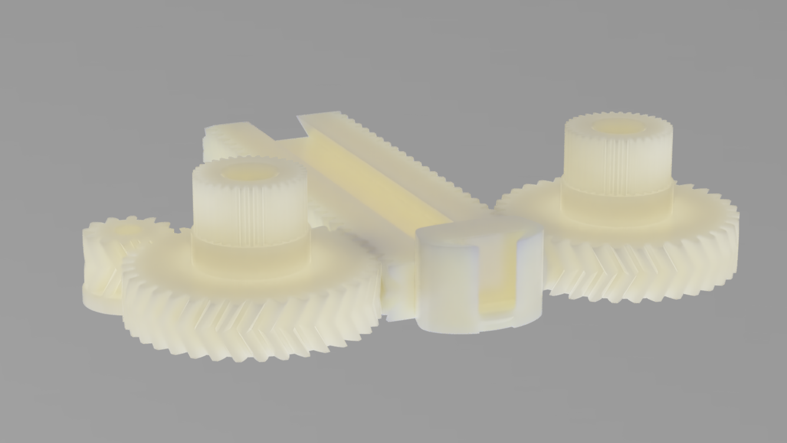
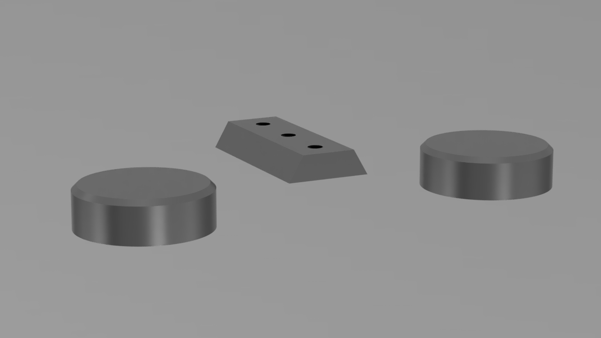

# Dynamixel Base System
>Coming soon
# Lynxmotion Base System
## Assembly animation

## Partlists
### Electronic
| Name  | Description  | Reference |
|---|---|---|
| Raspberry Pi 4B  | Embedded Linux Computer   | [raspberrypi.org](https://www.raspberrypi.org/products/raspberry-pi-4-model-b/)
|Lynxmotion LSS HT1 | Smart Servomotor | [robotshop.com](https://www.robotshop.com/de/de/lynxmotion-smart-servo-lss---hohes-drehmoment-ht1.html)
| Pololu D36V50F12 | Step Down 24V/12V |  [pololu](https://www.pololu.com/product/4095) |
| Pololu D36V50F5 | Step Down 24V/5V | [pololu](https://www.pololu.com/product/4091) |

### Screws
| Name | Application |Qty | Reference |
| --- |--- | --- | --- |
| 3.0X14 TORX rounded head | Case-screws | 6 | [Wuerth](https://eshop.wuerth.de/WUPLAST-Linsenkopfschraube-mit-Innensechsrund-SHR-LIKPF-W1452-T10-109-A3K-3X14/42283%20%2014.sku/de/DE/EUR/) |
| 3.0X6 TORX rounded head | Trapezodial-guide | 3 | [Wuerth](https://eshop.wuerth.de/WUPLAST-Linsenkopfschraube-mit-Innensechsrund-SHR-LIKPF-W1452-T10-109-A3K-3X6/42283%20%206.sku/de/DE/EUR/)|
| 3.0X10 TORX rounded head| Shafts| 6 | [Wuerth](https://eshop.wuerth.de/WUPLAST-Linsenkopfschraube-mit-Innensechsrund-SHR-LIKPF-W1452-T10-109-A3K-3X10/42283%20%2010.sku/de/DE/EUR/) |
| 2-56, 1/4"  SOCKET HEAD | Servomotor | 6 | [McMaster](https://www.mcmaster.com/91251A077/) |
| M5 Square-Nut DIN 557 | Flanges | 2 | [Wuerth](https://eshop.wuerth.de/Produktkategorien/DIN-557-Stahl-5-verzinkt/14013512180106.cyid/1401.cgid/de/DE/EUR/?CampaignName=SR001&CatalogCategoryRef=14013512180106%40WuerthGroup-Wuerth-1401&SelectedFilterAttribut=%255B%255D) |

# Drive Parts

> [>> drive-parts](drive-parts)

# Metal Guide Parts

> [>> metal-guide-parts](guide-parts-metal)

# Nylon Guide Parts

> [>> metal-guide-nylon](guide-parts-nylon)
