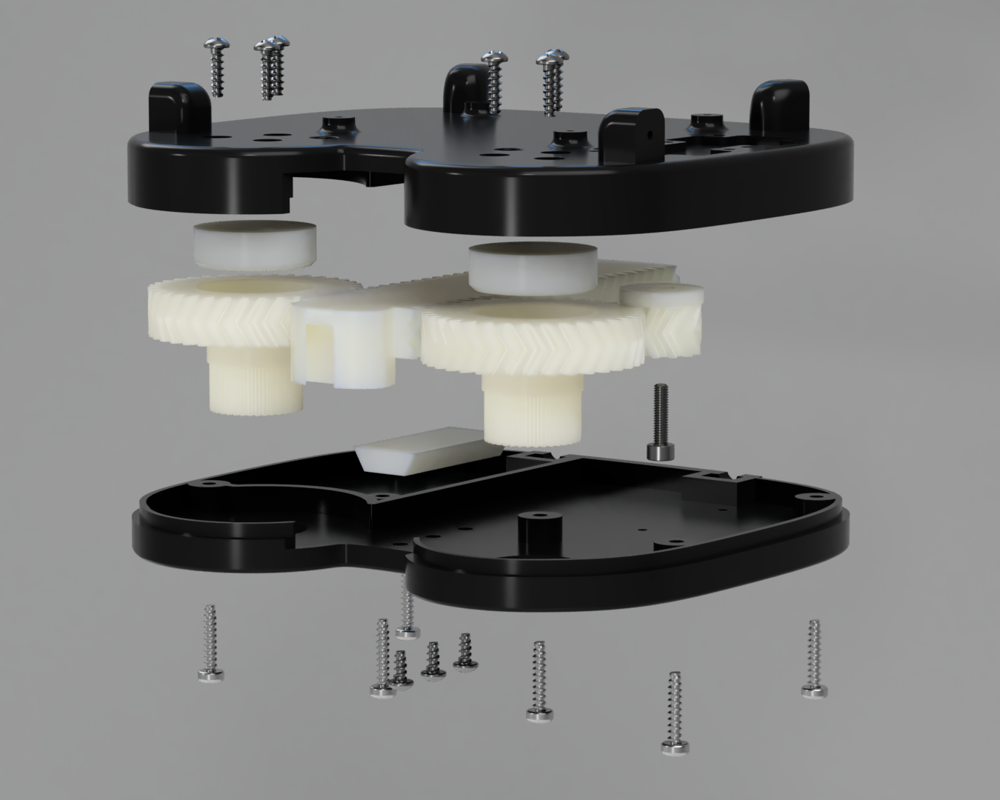

# Dynamixel Base System
>Coming soon
# Lynxmotion Base System

> [>>lynxmotion-system](lynxmotion-system)
## Partlist
| Name  | Description  | Reference |
|---|---|---|
| Raspberry Pi 4B  | Embedded Linux Computer   | [raspberrypi.org](https://www.raspberrypi.org/products/raspberry-pi-4-model-b/)
|Lynxmotion LSS HT1 | Smart Servomotor | [robotshop.com](https://www.robotshop.com/de/de/lynxmotion-smart-servo-lss---hohes-drehmoment-ht1.html)
| Pololu D36V50F12 | Step Down 24V/12V |  [pololu](https://www.pololu.com/product/4095) |
| Pololu D36V50F5 | Step Down 24V/5V | [pololu](https://www.pololu.com/product/4091) |

## Electrical Circuit
+ electrical drawing with wire
+ draw.io action

## Cable Set

# Drive Parts

# Metal Guide Parts

# Nylon Guide Parts

